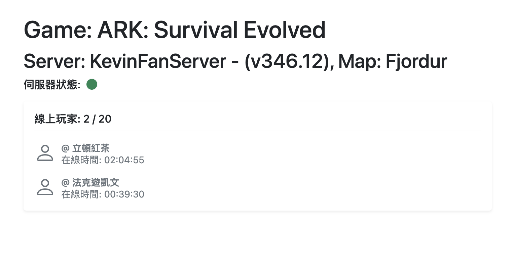

## Getting Started

First, run the development server:

```bash
npm run dev
# or
yarn dev
```

.env
```
NEXT_PUBLIC_GAME_HOST=localhost  // change me
NEXT_PUBLIC_GAME_TYPE=arkse
PORT=3000
```

## screenshot
